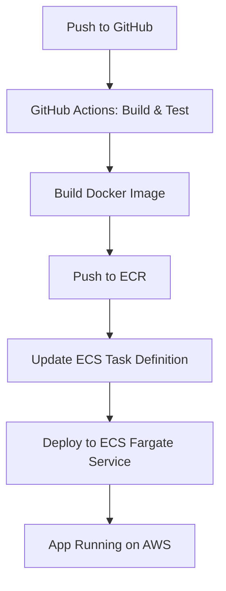

# Address Book REST Service

## Overview
A Spring Boot RESTful web service for managing address book contacts.

---

## Features
- CRUD operations for contacts
- REST API with OpenAPI/Swagger docs
- In-memory persistence (default)
- Dockerized for easy deployment
- CI/CD pipeline for AWS ECS Fargate

---

## Local Development

### Prerequisites
- Java 21
- Maven 3.9+

### Build & Run
```sh
mvn clean package
java -jar target/addressbook-rest-service-*.jar
```

---

## Docker

### Build Docker Image
```sh
docker build -t addressbook:latest ./addressbook-rest-service
```

### Run Docker Container
```sh
docker run -p 8080:8080 addressbook:latest
```

---

## CI/CD & AWS Deployment

This project includes a GitHub Actions workflow to:
- Build and test the app
- Build and push a Docker image to Amazon ECR
- Deploy to AWS ECS Fargate

### Prerequisites
- AWS account
- ECR repository (default: `addressbook`)
- ECS cluster (default: `addressbook-cluster`)
- ECS service (default: `addressbook-service`)
- ECS task definition (default: `addressbook-task`)
- IAM role for ECS tasks (`ecsTaskExecutionRole`)
- VPC, subnets, and security group (allow port 8080)
- GitHub secrets: `AWS_ACCESS_KEY_ID`, `AWS_SECRET_ACCESS_KEY`

### Workflow File
See `.github/workflows/aws-deploy.yml` for details. **Update the TODOs with your actual AWS values.**

---

## Sample ECS Task Definition

```json
{
  "family": "addressbook-task", // TODO: Update if you use a different family name
  "networkMode": "awsvpc",
  "requiresCompatibilities": ["FARGATE"],
  "cpu": "512",
  "memory": "1024",
  "executionRoleArn": "arn:aws:iam::<YOUR_AWS_ACCOUNT_ID>:role/ecsTaskExecutionRole", // TODO: Update
  "containerDefinitions": [
    {
      "name": "addressbook", // Should match CONTAINER_NAME in your workflow
      "image": "<YOUR_AWS_ACCOUNT_ID>.dkr.ecr.<AWS_REGION>.amazonaws.com/addressbook:latest", // TODO: Update
      "portMappings": [
        { "containerPort": 8080, "protocol": "tcp" }
      ],
      "essential": true,
      "environment": [],
      "logConfiguration": {
        "logDriver": "awslogs",
        "options": {
          "awslogs-group": "/ecs/addressbook", // TODO: Update
          "awslogs-region": "<AWS_REGION>",    // TODO: Update
          "awslogs-stream-prefix": "ecs"
        }
      }
    }
  ]
}
```

---

## AWS Setup Steps

1. **Create ECR Repository**
   - Console: ECR > Create repository > Name: `addressbook`
   - CLI: `aws ecr create-repository --repository-name addressbook --region us-east-1`

2. **Create ECS Cluster**
   - Console: ECS > Clusters > Create > Networking only (Fargate) > Name: `addressbook-cluster`
   - CLI: `aws ecs create-cluster --cluster-name addressbook-cluster --region us-east-1`

3. **Create IAM Role for ECS Tasks**
   - Console: IAM > Roles > Create role > ECS Task > Attach `AmazonECSTaskExecutionRolePolicy`
   - CLI: See README for policy JSON

4. **Register Task Definition**
   - Update the sample JSON above and run:
   ```sh
   aws ecs register-task-definition --cli-input-json file://ecs-task-definition.json --region us-east-1
   ```

5. **Create ECS Service**
   - Console: ECS > Cluster > addressbook-cluster > Create > Service > Fargate
   - CLI: See README for CLI example

6. **Set Up GitHub Secrets**
   - In your repo: Settings > Secrets and variables > Actions
   - Add `AWS_ACCESS_KEY_ID` and `AWS_SECRET_ACCESS_KEY`

7. **Trigger Deployment**
   - Push to `main` branch. GitHub Actions will build, push, and deploy automatically.

---

## CI/CD & Deployment Diagram



---

## Notes
- Update all `TODO` and placeholder values with your actual AWS account, region, and resource names.
- For more details, see the comments in `.github/workflows/aws-deploy.yml` and the sample ECS task definition above.

---

## License
Apache 2.0
